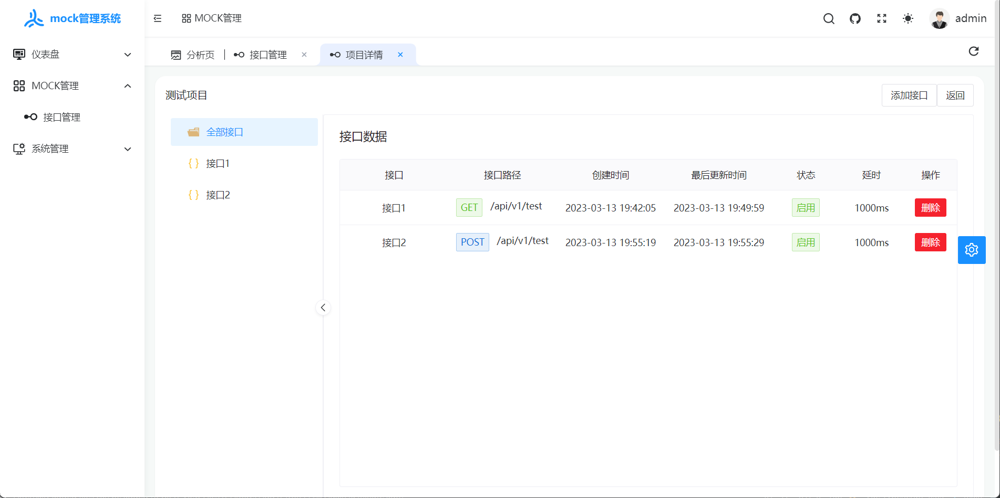
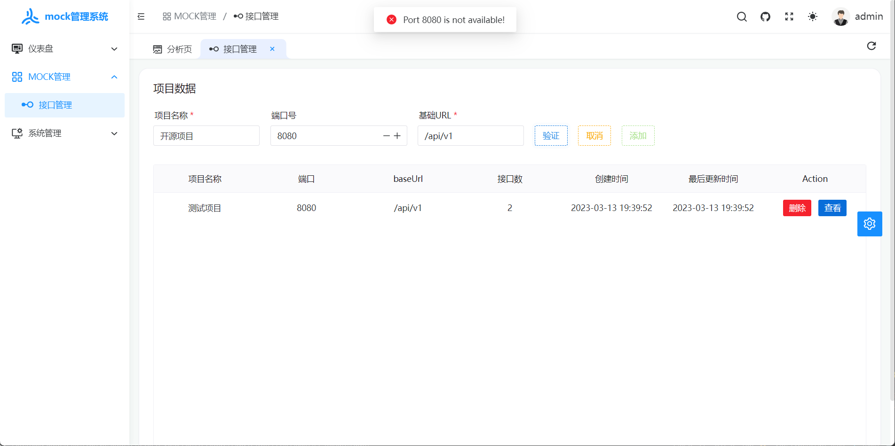

<div align="center">
	<h1>electron-vite-vue-admin</h1>
</div>

## 简介

[electron-mock-admin](https://github.com/lixin59/electron-mock-api) 是一个Mock Api 管理系统

## 特性
1. 日志记录
2. 本地配置存储

## v1版本计划
1. - [x] 后端服务
2. - [x] 项目管理配置界面
3. - [ ] 数据看板
4. - [ ] 日志界面
5. - [ ] 用户鉴权

## 文档

- [使用说明](./docs/readme.md)


## 项目数据
本产品所有的数据文件用户目录下的`.app-mock-admin`文件夹中

### 日志文件
- windows `C:\Users\<username>\.app-mock-admin\logs\`
- linux `/home/<username>/.app-mock-admin/logs/`

### 接口数据
本产品的接口和项目通过json文件进行管理文件地址在用户目录下
- windows `C:\Users\<username>\.app-mock-admin\projects\`
- linux `/home/<username>/.app-mock-admin/projects/`
```json
{
    "config": {
        "projectName": "测试项目",
        "baseUrl": "/api/v1",
        "port": 8080,
        "createdAt": 1678707592401,
        "id": 1678707592401,
        "lastUpdateAt": 1678707592401
    },
    "mockList": [
        {
            "name": "接口1",
            "enable": true,
            "url": "/test",
            "id": 1678707725807,
            "method": "get",
            "createdAt": 1678707725807,
            "lastUpdateAt": 1678708199903,
            "data": "{\"code\":200,\"msg\":\"test\",\"data\":{\"list|1-10\":[{\"id|+1\":1}]}}",
            "rules": [
                {
                    "name": "name",
                    "key": 0,
                    "type": "string",
                    "required": true,
                    "message": "缺少name字段或者字段类型不正确"
                }
            ],
            "timeout": 1000,
            "responseType": "json"
        },
        {
            "name": "接口2",
            "enable": true,
            "url": "/test",
            "id": 1678708519562,
            "method": "post",
            "createdAt": 1678708519562,
            "lastUpdateAt": 1678708529198,
            "data": "{\"code\":200,\"msg\":\"test\",\"data\":{\"list|1-10\":[{\"id|+1\":1}]}}",
            "rules": [
                {
                    "name": "",
                    "key": 0,
                    "type": "string",
                    "required": false,
                    "message": ""
                }
            ],
            "timeout": 1000,
            "responseType": "json"
        }
    ]
}
```

## 项目示例图


## 安装使用

- 环境配置
	**本地环境需要安装 pnpm 7.x 、Node.js 16+ 和 Git**

- 安装依赖

```bash
pnpm i
```

- 运行

```bash
pnpm dev
```

- 打包

```bash
pnpm build
```

## 如何贡献

非常欢迎您的加入！[提一个 Issue](https://github.com/lixin59/electron-mock-api/issues) 或者提交一个 Pull Request。

## Git 贡献提交规范

项目已经内置 angular 提交规范，直接执行 commit 命令即可。

项目已用 simple-git-hooks 代替了 husky, 旧版本用了 husky，执行 pnpm soy init-git-hooks 进行初始化配置

`electron-vite-vue-admin` 是完全开源免费的项目.

## 特别鸣谢

感谢[Soybean Admin](https://github.com/honghuangdc/soybean-admin)和[electron-vite](https://github.com/electron-vite/electron-vite-vue)开源的项目模板
