# 使用说明

## 添加项目
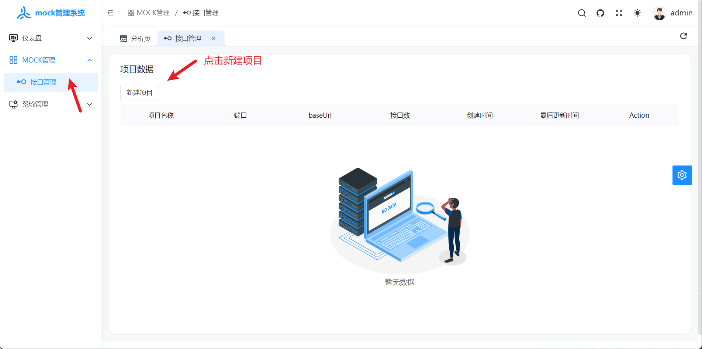
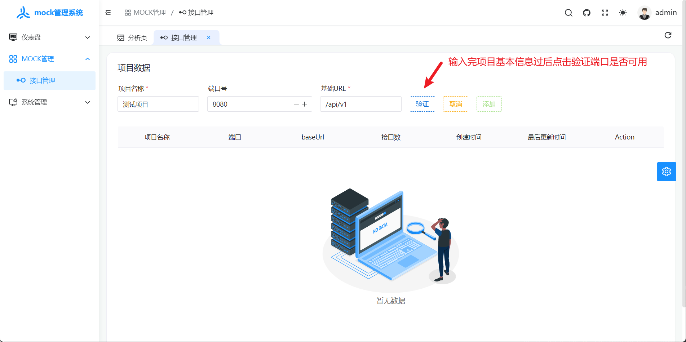
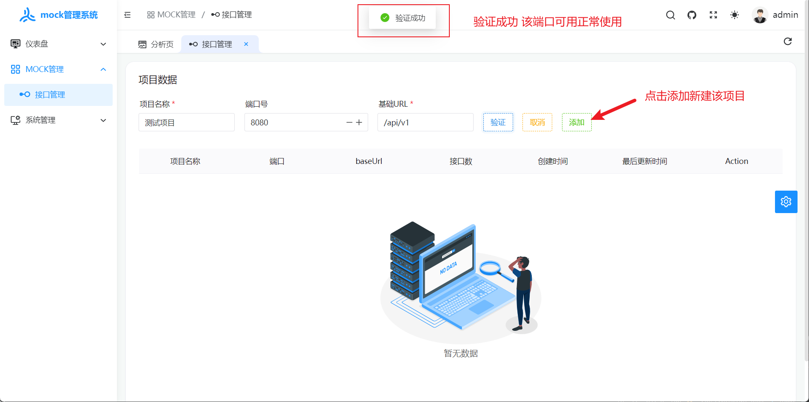

## 查看项目详情
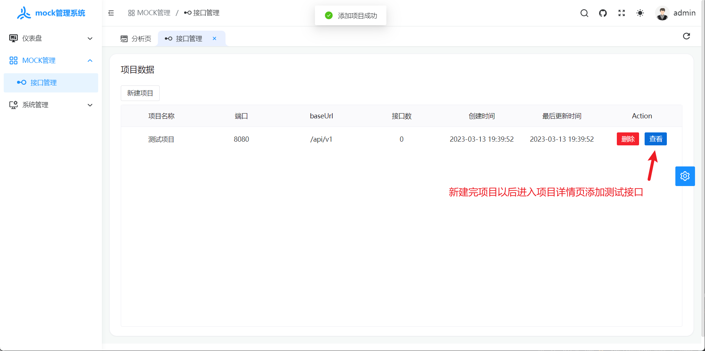

## 添加接口
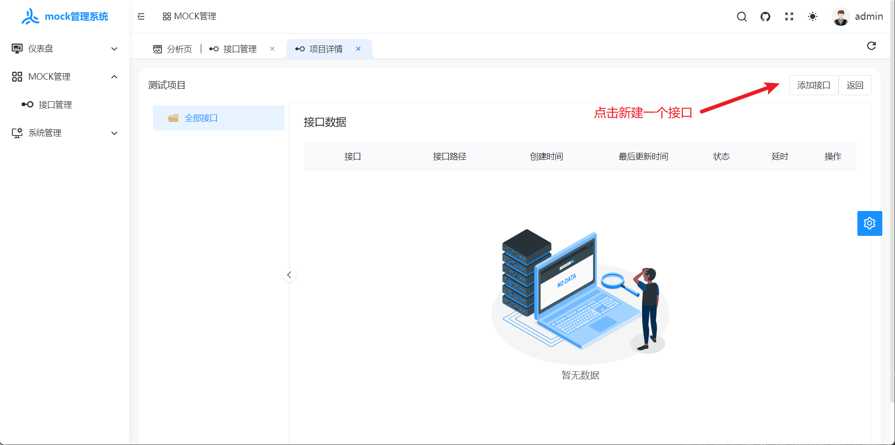
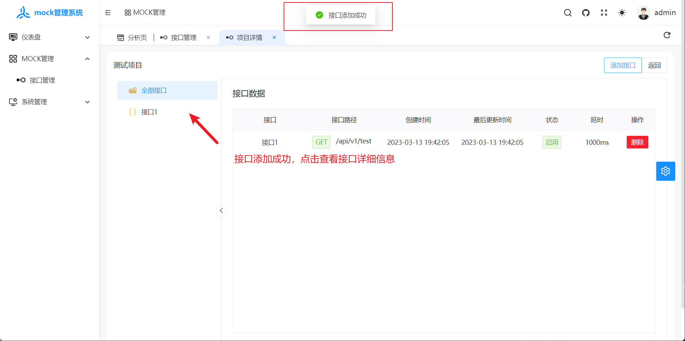

## 编辑接口
### 接口返回结果内容编辑
1. 普通json数据
```json
{
    "code": 200,
    "msg": "test",
    "data": {"name": "张三","age": 20}
}
```
2. [mockjs语法规则json数据](https://github.com/nuysoft/Mock/wiki/Syntax-Specification)

```json
{
	"code": 200,
	"msg": "test",
	"data": {
		"list|1-10": [
			{
				"id|+1": 1
			}
		]
	}
}
```
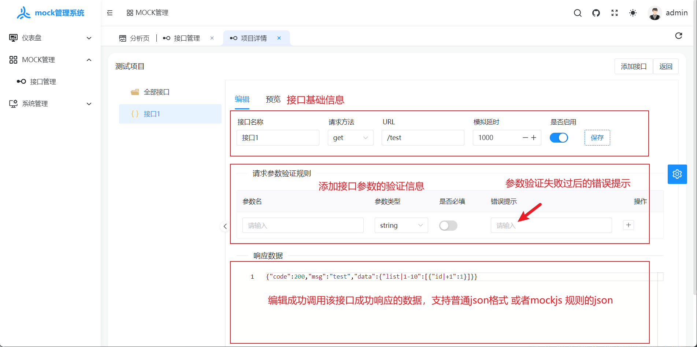
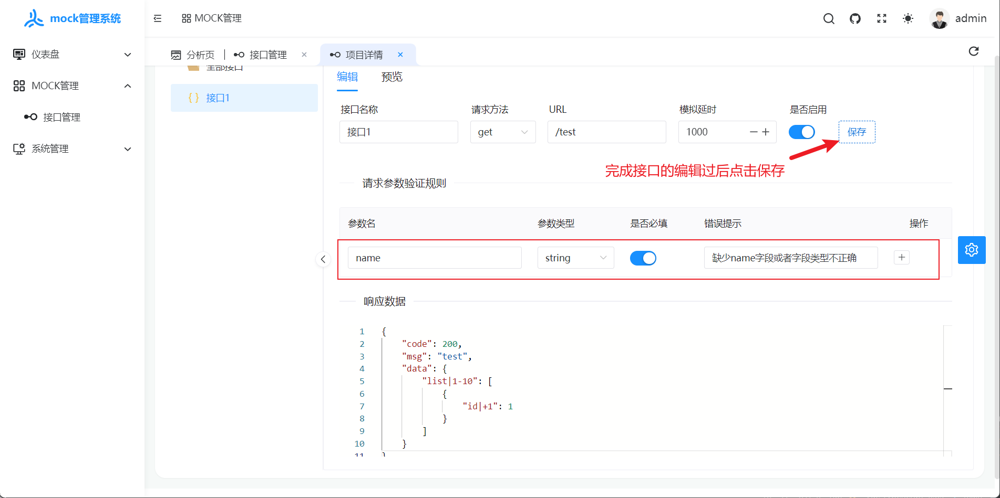

## 接口预览与测试
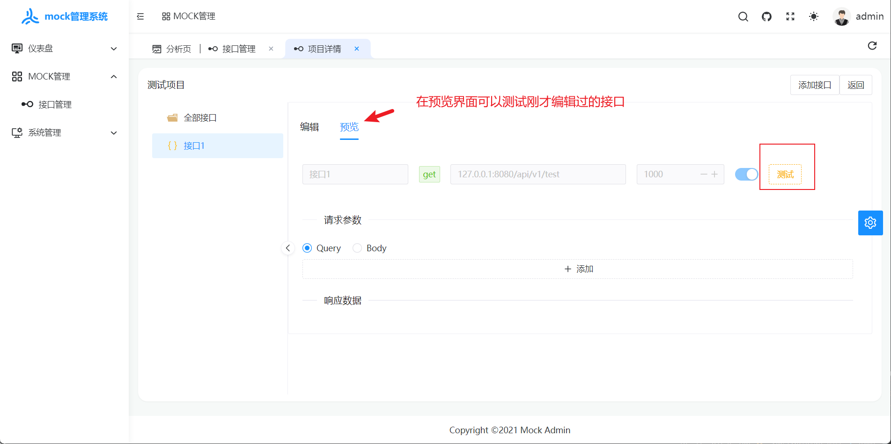

### 错误响应
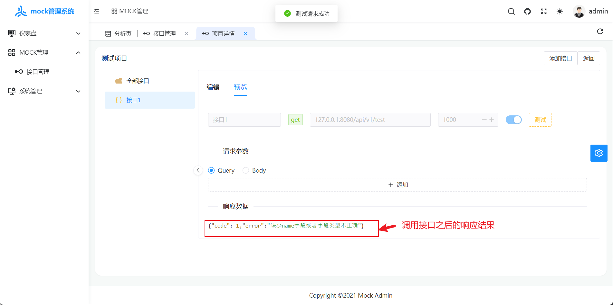
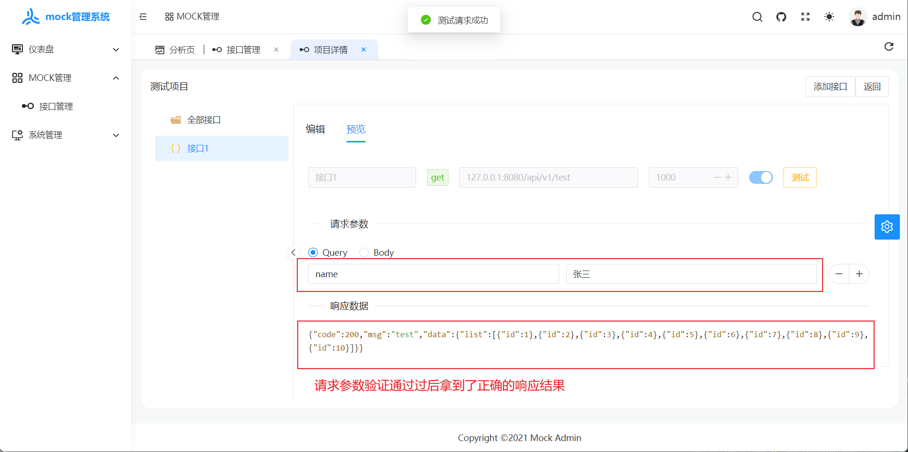
